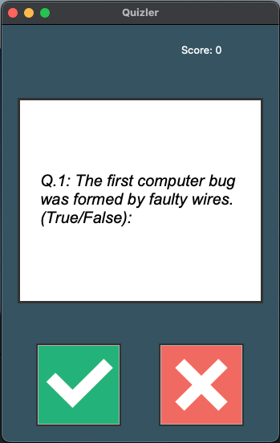

# Quizler App

Quizler is a simple True/False quiz application built with Python and Tkinter. It presents users with a series of True/False questions fetched from an external API, allowing them to select their answers through a user interface.



## Installation

To run the Quizler app, follow these steps:

1. Clone this repository to your local machine.
2. Make sure you have Python installed.
3. Install the required dependencies by running `pip install -r requirements.txt`.
4. Run the `main.py` file to start the application.

## How to Use

Upon launching the Quizler app, users will be presented with True/False questions fetched from an external API. They can select their answers by clicking the corresponding buttons on the user interface. The app will provide feedback on whether the selected answer was correct or not and keep track of the user's score.

## Components

The Quizler app consists of the following components:

- **main.py**: The main script that initializes the QuizBrain, QuizInterface, and other necessary components to run the application.
- **data.py**: Fetches question data from an external API and stores it in the `question_data` variable.
- **quiz_brain.py**: Defines the QuizBrain class, which manages the quiz logic, including fetching questions, checking answers, and calculating scores.
- **question_model.py**: Defines the Question class, which represents a single True/False question.
- **ui.py**: Defines the QuizInterface class, which creates the graphical user interface for the application using Tkinter.

## Dependencies

The Quizler app relies on the following dependencies:

- `requests`: Used for making HTTP requests to fetch question data from an external API.
- `Tkinter`: Python's standard GUI library for creating the user interface.

## Usage Example

```python
# Run the main.py file to start the Quizler app
python main.py
